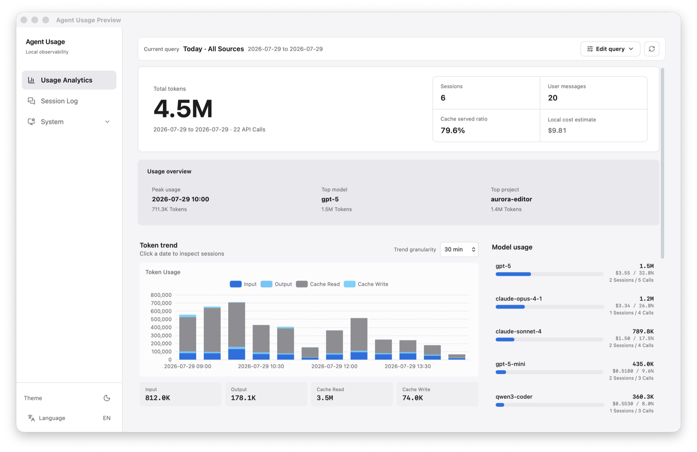
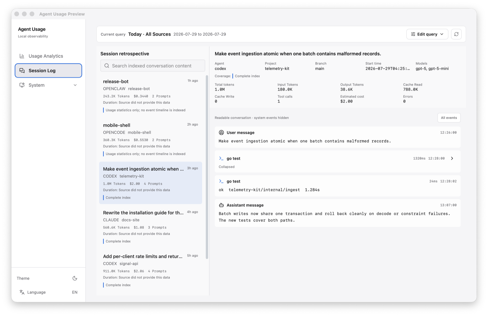

<p align="center">
  
</p>

<h1 align="center">Agent Usage</h1>

<p align="center">
  A desktop app for local usage, cost, throughput, and session analytics across AI coding agents.
</p>

<p align="center">
  <a href="README.zh-CN.md">中文文档</a>
</p>

<p align="center">
  <a href="LICENSE"></a>
  <a href="https://tauri.app"></a>
  <a href="https://react.dev"></a>
  <a href="https://www.typescriptlang.org"></a>
  <a href="https://go.dev"></a>
  <a href="https://www.rust-lang.org"></a>
  <a href="https://sqlite.org"></a>
</p>

Agent Usage reads the session and usage records already stored on this computer, normalizes them into a local SQLite index, and presents them in a focused desktop workspace. It is designed for one person inspecting their own coding-agent activity; there is no account, cloud database, or session upload.

<p align="center">
  
</p>

## Highlights

- Compare token usage, estimated cost, prompts, sessions, API calls, RPM, and TPM across supported agents.
- Filter the workspace by time range, source, model, and project, then carry the same query into session search.
- Search and inspect readable Claude Code and Codex event timelines, including tool calls and errors.
- Scan incrementally, deduplicate records, and rebuild the local index from source files when needed.
- Use immutable pricing snapshots with bundled offline fallback, online LiteLLM refresh, and JSON import.
- Run from the system tray with autostart, cost notifications, English/Chinese UI, and light/dark themes.

<p align="center">
  
</p>

## Supported Sources

| Source | Default location | Usage analytics | Session retrospective |
| --- | --- | :---: | :---: |
| [Claude Code](https://docs.anthropic.com/en/docs/claude-code) | `~/.claude/projects` | Yes | Yes |
| [Codex CLI](https://github.com/openai/codex) | `~/.codex/sessions` | Yes | Yes |
| [OpenCode](https://github.com/anomalyco/opencode) | `~/.local/share/opencode/opencode.db` | Yes | No |
| [OpenClaw](https://github.com/openclaw/openclaw) | `~/.openclaw/agents` | Yes | No |

Collectors resume from stored file offsets, so unchanged JSONL content is not parsed again. OpenCode is read from its local SQLite database. All sources share one statistical model, while deep event indexing is intentionally limited to Claude Code and Codex in v2.0.

## Install

Download an installer from [GitHub Releases](https://github.com/hongshuo-wang/agent-usage-desktop/releases):

| Platform | Official v2.0 artifact |
| --- | --- |
| macOS Apple Silicon | `Agent Usage_2.0.0_aarch64.dmg` |
| Windows x64 | `Agent Usage_2.0.0_x64-setup.exe` |

macOS Intel and Linux users can build from source. These platforms do not have official v2.0 installers.

The macOS build is currently unsigned. After moving the app to Applications, remove its quarantine attribute once if macOS reports that the app is damaged:

```bash
xattr -cr "/Applications/Agent Usage.app"
```

Launch Agent Usage. The sidecar starts on a loopback-only dynamic port and scans enabled local sources in the background.

## Privacy and Network Access

Raw agent files remain the source of truth. The SQLite index and configuration stay on this computer and can be rebuilt. Session content is never uploaded, and the local API binds to loopback.

The only routine network request is model-pricing refresh from [LiteLLM's jsDelivr mirror](https://cdn.jsdelivr.net/gh/BerriAI/litellm@main/model_prices_and_context_window.json). A bundled catalog lets first-run cost estimation work offline. Online refresh and manual import never rewrite costs already assigned from historical pricing snapshots.

## Metric Semantics

Token totals use four non-overlapping components:

```text
total input  = non-cached input + cache read input + cache creation input
total output = output tokens
total tokens = total input + total output
```

Reasoning output is informational and is already a subset of output tokens, so it is not added again. RPM and TPM are locally observed throughput, not provider quota, remaining capacity, or rate-limit utilization. Displayed cost is a local estimate, not a provider invoice.

## Configuration

The desktop app creates `~/.config/agent-usage/config.yaml` on first launch. Data sources and application behavior can also be managed in Settings.

```yaml
server:
  port: 9800
  bind_address: "127.0.0.1"

collectors:
  claude:
    enabled: true
    paths: ["~/.claude/projects"]
    scan_interval: 60s
  codex:
    enabled: true
    paths: ["~/.codex/sessions"]
    scan_interval: 60s
  openclaw:
    enabled: true
    paths: ["~/.openclaw/agents"]
    scan_interval: 60s
  opencode:
    enabled: true
    paths: ["~/.local/share/opencode/opencode.db"]
    scan_interval: 60s

storage:
  path: "~/.config/agent-usage/agent-usage.db"

pricing:
  sync_interval: 1h
```

## Build From Source

Prerequisites: [Go](https://go.dev/) 1.25+, [Node.js](https://nodejs.org/) 24+, and [Rust](https://rustup.rs/) stable. Linux also requires `libwebkit2gtk-4.1-dev` and `libappindicator3-dev`.

```bash
npm install

# macOS Apple Silicon sidecar
CGO_ENABLED=0 GOOS=darwin GOARCH=arm64 \
  go build -o src-tauri/binaries/agent-usage-aarch64-apple-darwin .

npx tauri dev
```

For a production build, prepare the sidecar matching the target and run `npx tauri build`:

```bash
# macOS Intel
CGO_ENABLED=0 GOOS=darwin GOARCH=amd64 \
  go build -o src-tauri/binaries/agent-usage-x86_64-apple-darwin .

# Linux x64
CGO_ENABLED=0 GOOS=linux GOARCH=amd64 \
  go build -o src-tauri/binaries/agent-usage-x86_64-unknown-linux-gnu .

# Windows x64
CGO_ENABLED=0 GOOS=windows GOARCH=amd64 \
  go build -o src-tauri/binaries/agent-usage-x86_64-pc-windows-msvc.exe .
```

Tauri requires the sidecar name `agent-usage-{rust-target-triple}[.exe]`.

The Go backend can also run on its own:

```bash
go build -o agent-usage-desktop .
./agent-usage-desktop
./agent-usage-desktop --config path/to/config.yaml
./agent-usage-desktop --port 9800
./agent-usage-desktop version
```

Run the complete local verification suite with:

```bash
go test ./...
go vet ./...
npm test
npm run build
cargo test --manifest-path src-tauri/Cargo.toml
```

## Architecture

The React and TypeScript frontend runs inside Tauri v2. Rust manages the desktop window, tray, notifications, autostart, and Go sidecar lifecycle. The pure-Go sidecar collects local records, stores the normalized index with `modernc.org/sqlite` (no CGO), calculates snapshot-based costs, and serves the loopback REST API consumed by the UI.

## Contributing

Issues and pull requests are welcome. See [CONTRIBUTING.md](CONTRIBUTING.md) for the development workflow and [SECURITY.md](SECURITY.md) for private vulnerability reporting.

## Community

- [GitHub Issues](https://github.com/hongshuo-wang/agent-usage-desktop/issues)

## License

Agent Usage is licensed under the [Apache License 2.0](LICENSE).
