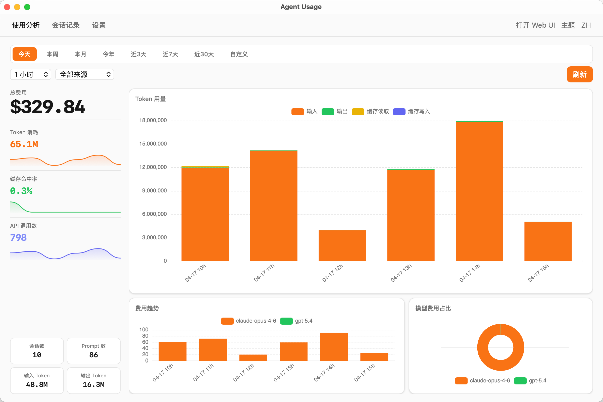

# Agent Usage

[](https://go.dev)
[](LICENSE)
[]()

Agent Usage 是一款用于了解 AI 编程 Agent 用量、费用、吞吐和会话历史的本地单用户应用。

**[English](README.md)**

它读取这台电脑上已有的 Agent 源数据，构建本地 SQLite 索引，并通过 Tauri 桌面应用展示结果。Claude Code 和 Codex 支持深度会话回溯。OpenCode 和 OpenClaw 当前仅提供统计。

<p align="center">
  
</p>

## 主要能力

- 汇总受支持本地 Agent 的用量和费用趋势
- 按项目、模型和来源分析
- 分析本机观测 RPM/TPM 吞吐
- 搜索 Claude Code 和 Codex 会话，并通过可读事件时间线回溯
- 增量扫描与自动去重
- 费用告警、系统托盘、开机自启、深浅色主题和中英文界面

主导航为总览、会话和设置。总览汇总用量与费用；会话支持筛选、全文搜索和时间线回溯；设置用于管理本地采集器和应用行为。

## 数据来源

| 来源 | 默认位置 | 输入格式 | 当前能力 |
| --- | --- | --- | --- |
| [Claude Code](https://docs.anthropic.com/en/docs/claude-code) | `~/.claude/projects/<project>/<session>.jsonl` | JSONL | 统计与深度会话回溯 |
| [Codex CLI](https://github.com/openai/codex) | `~/.codex/sessions/<year>/<month>/<day>/<session>.jsonl` | JSONL | 统计与深度会话回溯 |
| [OpenClaw](https://github.com/openclaw/openclaw) | `~/.openclaw/agents/<agentId>/sessions/<sessionId>.jsonl` | JSONL | 仅统计 |
| [OpenCode](https://github.com/anomalyco/opencode) | `~/.local/share/opencode/opencode.db` | SQLite | 仅统计 |

采集器会增量读取，并记录文件偏移，避免重复解析未变化的内容。各来源会被归一化到同一套统计模型；当前只有 Claude Code 和 Codex 会写入会话回溯事件索引。

## 指标语义

Token 总量由四个互不重叠的分项组成：

- **非缓存输入**：既不是缓存读取、也不是缓存创建的输入
- **缓存读取输入**：从缓存中读取的输入
- **缓存创建输入**：写入缓存的输入
- **输出 token**：全部生成输出

总量计算方式：

```text
总输入   = 非缓存输入 + 缓存读取输入 + 缓存创建输入
总输出   = 输出 token
token 总量 = 总输入 + 总输出
```

推理输出仅供参考，是输出 token 的子集，因此不会再次计入总输出。

RPM 和 TPM 是本机观测到的吞吐量，不代表供应商配额或限流利用率。它们只描述本地源记录中可见的 API 调用和 token，不能表示账号上限、剩余额度、限流状态，也不包含未写入这些文件的流量。

## 本地数据与网络访问

Agent 原始文件是事实来源。源文件或解析器版本变化时，SQLite 索引可以重建。默认数据库和配置都保留在这台电脑上。

应用不会上传会话内容，默认只在 loopback 地址提供 API。价格同步是唯一的常规网络请求：应用从 [litellm 的 GitHub 数据](https://github.com/BerriAI/litellm/blob/main/model_prices_and_context_window.json)读取模型价格，保存到本地，并在价格变化后重新计算索引中的费用。

## 安装

从 [GitHub Releases](https://github.com/hongshuo-wang/agent-usage-desktop/releases) 下载受支持平台的安装包：

| 平台 | 文件 |
| --- | --- |
| macOS（Apple Silicon） | `Agent Usage_x.x.x_aarch64.dmg` |
| Windows | `Agent Usage_x.x.x_x64-setup.exe` |

macOS Intel 和 Linux 请从源码构建。

未签名的 macOS 构建可能被系统提示为“已损坏”。将应用移动到 Applications 后，运行一次：

```bash
xattr -cr "/Applications/Agent Usage.app"
```

启动 Agent Usage 后，应用会在系统托盘运行，并开始扫描已启用的本地来源。

## 配置

桌面应用首次启动时会创建 `~/.config/agent-usage/config.yaml`，也可以在应用设置中修改。

```yaml
server:
  port: 9800
  bind_address: "127.0.0.1"

collectors:
  claude:
    enabled: true
    paths: ["~/.claude/projects"]
    scan_interval: 60s
  codex:
    enabled: true
    paths: ["~/.codex/sessions"]
    scan_interval: 60s
  openclaw:
    enabled: true
    paths: ["~/.openclaw/agents"]
    scan_interval: 60s
  opencode:
    enabled: true
    paths: ["~/.local/share/opencode/opencode.db"]
    scan_interval: 60s

storage:
  path: "./agent-usage.db"

pricing:
  sync_interval: 1h
```

## 从源码构建

前置条件：

- [Go](https://go.dev/) 1.25+
- [Node.js](https://nodejs.org/) 20+
- [Rust](https://rustup.rs/) stable
- 仅 Linux：`libwebkit2gtk-4.1-dev` 和 `libappindicator3-dev`

安装依赖、准备 sidecar 并运行桌面应用：

```bash
npm install

# macOS Apple Silicon
CGO_ENABLED=0 GOOS=darwin GOARCH=arm64 \
  go build -o src-tauri/binaries/agent-usage-aarch64-apple-darwin .

npx tauri dev
```

生产构建使用同样的 sidecar 步骤，然后运行：

```bash
npx tauri build
```

Tauri 要求 sidecar 使用 `agent-usage-{rust-target-triple}[.exe]` 命名。请构建与桌面目标一致的二进制：

```bash
# macOS Apple Silicon
CGO_ENABLED=0 GOOS=darwin GOARCH=arm64 \
  go build -o src-tauri/binaries/agent-usage-aarch64-apple-darwin .

# macOS Intel
CGO_ENABLED=0 GOOS=darwin GOARCH=amd64 \
  go build -o src-tauri/binaries/agent-usage-x86_64-apple-darwin .

# Linux x86_64
CGO_ENABLED=0 GOOS=linux GOARCH=amd64 \
  go build -o src-tauri/binaries/agent-usage-x86_64-unknown-linux-gnu .

# Windows x86_64
CGO_ENABLED=0 GOOS=windows GOARCH=amd64 \
  go build -o src-tauri/binaries/agent-usage-x86_64-pc-windows-msvc.exe .
```

开发期间也可以单独运行 Go 后端：

```bash
go build -o agent-usage-desktop .
./agent-usage-desktop
./agent-usage-desktop --config path/to/config.yaml
./agent-usage-desktop --port 9800
./agent-usage-desktop version
```

运行项目全部检查：

```bash
go test ./...
npm test
npm run build
cargo test --manifest-path src-tauri/Cargo.toml
```

## 费用计算

价格以单 token 计并保存在本地。四个 token 分项互不重叠，因此计算费用时不会再次从输入中扣除缓存 token：

```text
费用 = 非缓存输入 × 输入价格
     + 缓存创建输入 × 缓存创建价格
     + 缓存读取输入 × 缓存读取价格
     + 输出 token × 输出价格
```

## 技术栈

- Tauri v2、Rust 进程层与系统 WebView
- React、TypeScript、Vite、Tailwind CSS 和 ECharts
- 纯 Go 后端和 `modernc.org/sqlite`，无需 CGO

## 路线图

- [ ] Hermes 会话回溯支持
- [ ] 只读发现全局 `CLAUDE.md`、`AGENTS.md` 和 memory 文件，并由用户显式导入到项目级
- [ ] 带项目名称、GitHub 链接和 Linux.do 链接的品牌化 PNG/PDF BI 分享

## 社区

源代码与问题反馈：[GitHub](https://github.com/hongshuo-wang/agent-usage-desktop)

讨论：[Linux.do](https://linux.do/t/topic/1922004)

## 许可证

[Apache 2.0](LICENSE)
