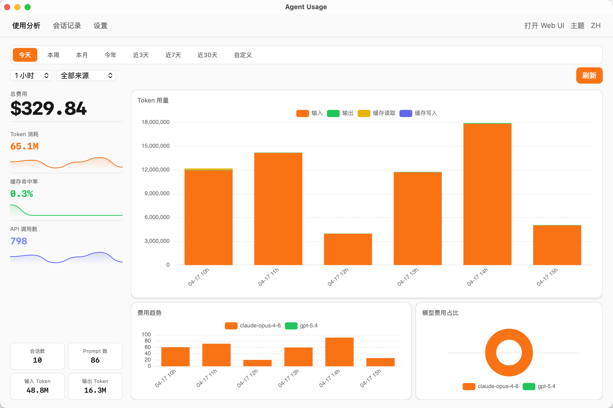
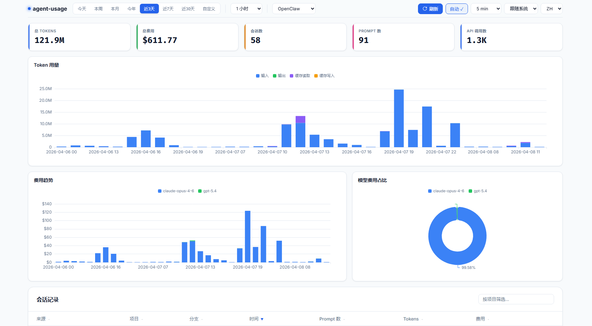

# agent-usage-desktop

[](https://go.dev)
[](LICENSE)
[]()

轻量级、跨平台的 AI 编程工具用量与费用追踪桌面应用。

**[English](README.md)**

统一采集 Claude Code、Codex、OpenClaw、OpenCode 等 AI 编程工具的本地会话数据，自动计算费用，通过内置仪表板展示 token 用量、费用趋势和会话明细。

<p align="center">
  
</p>
<p align="center">
  
</p>

## 特性

- **本地文件解析** — 直接读取 Claude Code、Codex CLI、OpenClaw 的会话文件和 OpenCode 的 SQLite 数据库
- **自动费用计算** — 从 [litellm](https://github.com/BerriAI/litellm) 获取模型价格，价格更新后自动回填历史记录
- **SQLite 存储** — 单文件、零运维、数据可修正
- **仪表板** — 深色/浅色主题 UI，ECharts 图表：费用分布、token 趋势、会话列表
- **增量扫描** — 监听新会话，自动去重
- **跨平台** — macOS、Windows、Linux
- **原生桌面应用** — Tauri v2，支持系统托盘、开机自启、费用告警通知、深色/浅色主题、中英文切换

## 安装

从 [GitHub Releases](https://github.com/hongshuo-wang/agent-usage-desktop/releases) 下载对应平台的安装包：

| 平台                    | 文件                                          |
| --------------------- | ------------------------------------------- |
| macOS (Apple Silicon) | `Agent Usage_x.x.x_aarch64.dmg`             |
| macOS (Intel)         | `Agent Usage_x.x.x_x64.dmg`                 |
| Windows               | `Agent Usage_x.x.x_x64-setup.exe`           |
| Linux                 | `Agent Usage_x.x.x_amd64.AppImage` 或 `.deb` |

**macOS 提示：** 由于应用未经 Apple 开发者签名，macOS 会提示"文件已损坏"。安装后运行一次以下命令即可：

```bash
xattr -cr "/Applications/Agent Usage.app"
```

启动应用后，它会在系统托盘运行并自动开始采集数据。

## 在 Agent 对话中查询用量

Skill 可独立使用，无需安装或运行 agent-usage-desktop 服务 — 直接解析本地会话文件即可工作。如果检测到 agent-usage-desktop 服务在运行，自动切换到 API 查询以获取更精确的费用数据。

```bash
# 通过 vercel-labs/skills 安装，支持 Claude Code、Cursor、Kiro 等 40+ 种 agent
npx skills add hongshuo-wang/agent-usage-desktop -y
```

安装后试试：`查下 agent usage`、`agent usage 统计` 或 `check agent usage`。详见 [`skills/agent-usage-desktop/SKILL.md`](skills/agent-usage-desktop/SKILL.md)。

## 配置

桌面应用的配置文件位于 `~/.config/agent-usage/config.yaml`（首次启动时自动创建）。也可以在应用设置中编辑。

```yaml
server:
  port: 9800
  bind_address: "127.0.0.1"

collectors:
  claude:
    enabled: true
    paths:
      - "~/.claude/projects"
    scan_interval: 60s
  codex:
    enabled: true
    paths:
      - "~/.codex/sessions"
    scan_interval: 60s
  openclaw:
    enabled: true
    paths:
      - "~/.openclaw/agents"
    scan_interval: 60s
  opencode:
    enabled: true
    paths:
      - "~/.local/share/opencode/opencode.db"
    scan_interval: 60s

storage:
  path: "./agent-usage.db"

pricing:
  sync_interval: 1h  # 从 GitHub 获取价格；如失败请设置 HTTPS_PROXY 环境变量
```

## 支持的数据源

| 来源                                                            | 会话路径                                                      | 格式     |
| ------------------------------------------------------------- | --------------------------------------------------------- | ------ |
| [Claude Code](https://docs.anthropic.com/en/docs/claude-code) | `~/.claude/projects/<项目>/<会话>.jsonl`                      | JSONL  |
| [Codex CLI](https://github.com/openai/codex)                  | `~/.codex/sessions/<年>/<月>/<日>/<会话>.jsonl`                | JSONL  |
| [OpenClaw](https://github.com/openclaw/openclaw)              | `~/.openclaw/agents/<agentId>/sessions/<sessionId>.jsonl` | JSONL  |
| [OpenCode](https://github.com/anomalyco/opencode)             | `~/.local/share/opencode/opencode.db`                     | SQLite |

## 从源码构建

如果你不想使用预构建的安装包，可以自己从源码构建：

### 前置条件

- [Go](https://go.dev/) 1.25+
- [Node.js](https://nodejs.org/) 20+
- [Rust](https://rustup.rs/)（stable）
- 平台特定依赖：
  - **Linux**: `libwebkit2gtk-4.1-dev`、`libappindicator3-dev`

### 构建步骤

```bash
git clone https://github.com/hongshuo-wang/agent-usage-desktop.git
cd agent-usage-desktop

# 1. 安装前端依赖
npm install

# 2. 为你的平台编译 Go sidecar（选一个）：

#    macOS Apple Silicon：
CGO_ENABLED=0 go build -o src-tauri/binaries/agent-usage-aarch64-apple-darwin .

#    macOS Intel：
CGO_ENABLED=0 GOOS=darwin GOARCH=amd64 go build -o src-tauri/binaries/agent-usage-x86_64-apple-darwin .

#    Linux x86_64：
CGO_ENABLED=0 GOOS=linux GOARCH=amd64 go build -o src-tauri/binaries/agent-usage-x86_64-unknown-linux-gnu .

#    Windows x86_64：
CGO_ENABLED=0 GOOS=windows GOARCH=amd64 go build -o src-tauri/binaries/agent-usage-x86_64-pc-windows-msvc.exe .

# 3. 构建桌面应用
npx tauri build
```

安装包位置：

- **macOS**: `src-tauri/target/release/bundle/dmg/`
- **Windows**: `src-tauri/target/release/bundle/nsis/`
- **Linux**: `src-tauri/target/release/bundle/appimage/` 或 `deb/`

### 开发模式（热更新）

```bash
# 先编译 sidecar（上面的步骤 2），然后：
npx tauri dev
```

## 仪表板

内置仪表板提供：

- **吸顶控制栏** — 时间预设、粒度、来源筛选（Claude/Codex/OpenClaw/OpenCode）、自动刷新
- **汇总卡片** — 总 Tokens、总费用、会话数、Prompt 数、API 调用数
- **Token 用量** — 堆叠柱状图（输入/输出/缓存读取/缓存写入）
- **费用趋势** — 按模型堆叠柱状图，颜色映射一致
- **模型费用占比** — 环形图，带百分比标签
- **会话列表** — 可排序、可筛选，展开查看模型明细
- **深色/浅色主题** — 跟随系统，支持手动切换
- **国际化** — 中英文
- **时区处理** — 时间戳以 UTC 存储，显示时自动转换为本地时区

## 费用计算

价格从 [litellm 模型价格数据库](https://github.com/BerriAI/litellm/blob/main/model_prices_and_context_window.json) 获取并存储在本地。

```
费用 = (输入 - 缓存读取 - 缓存创建) × 输入价格
     + 缓存创建 × 缓存创建价格
     + 缓存读取 × 缓存读取价格
     + 输出 × 输出价格
```

价格更新后，历史记录会自动回填。

## 技术栈

- **Tauri v2** — 桌面应用框架（Rust 内核 + 系统 WebView）
- **React 18** + TypeScript + Vite — 前端
- **Tailwind CSS v4** — 样式
- **Go** — 后端（纯 Go 实现，无需 CGO）
- **SQLite** via [`modernc.org/sqlite`](https://pkg.go.dev/modernc.org/sqlite) — 纯 Go SQLite 驱动
- **ECharts** — 图表库

## 路线图

- [ ] 更多 agent 数据源（Cursor、Copilot 等）
- [ ] 导出 CSV/JSON
- [x] ~~费用告警通知~~ — 已实现
- [ ] 多用户支持

## 社区

欢迎到 [Linux.do](https://linux.do/t/topic/1922004) 参与讨论和反馈。

## 许可证

[Apache 2.0](LICENSE)
